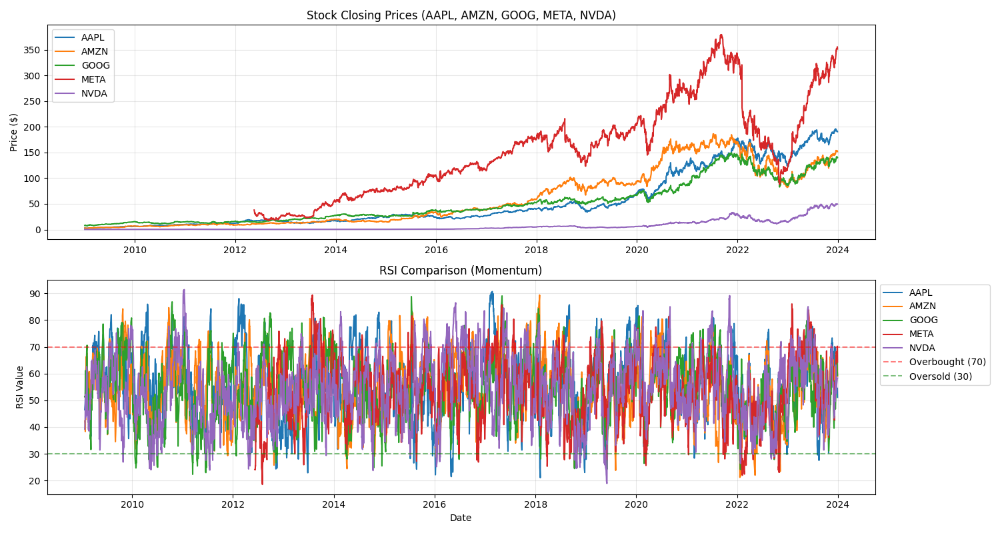
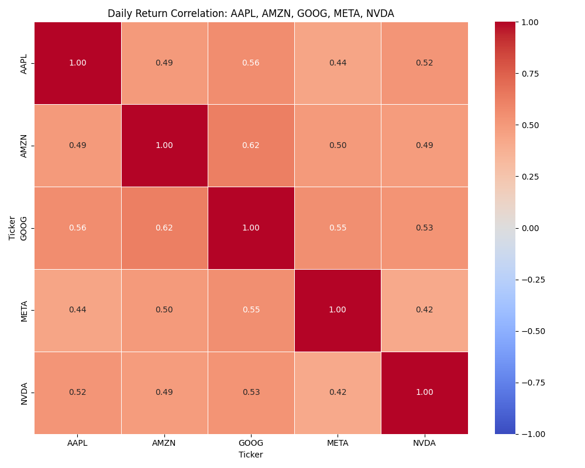
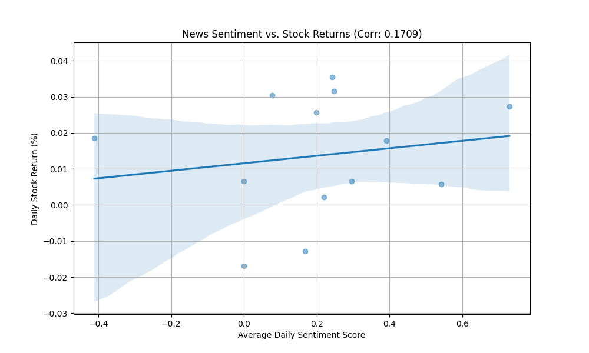

# Financial News Sentiment and Stock Price Analysis

## 📌 Project Overview
This project explores the relationship between financial news headlines and stock market movements for five major tech companies: **AAPL, AMZN, GOOG, META, and NVDA**. 

The goal was to determine if the "sentiment" (mood) of the news acts as a leading indicator for stock returns using Natural Language Processing (NLP) and Quantitative Analysis.

## 🛠️ Tech Stack
*   **Language:** Python 3.x
*   **Data Analysis:** Pandas, NumPy
*   **NLP:** NLTK (VADER Sentiment Analysis)
*   **Technical Analysis:** TA-Lib (SMA, RSI)
*   **Visualization:** Matplotlib, Seaborn

## 🚀 Tasks Completed

### Task 1: Sentiment Analysis
*   Cleaned and preprocessed a large dataset of financial news headlines.
*   Applied **VADER Sentiment Analysis** to assign a "Compound Score" (ranging from -1 to 1) to each headline.
*   Identified news publication trends and sentiment spikes over time.
     **Stock Technical Analysis:** 
### Task 2: Quantitative Analysis (Technical Indicators)
*   Calculated daily stock returns for the selected tickers.
*   Implemented technical indicators using **TA-Lib**:
    *   **SMA (20-Day):** To identify price trends.
    *   **RSI (Relative Strength Index):** To identify overbought or oversold conditions.
    *   **Rolling Volatility:** To measure market risk.
*   Generated a **Correlation Heatmap** to see how tech stocks move in relation to one another.
  **Return Correlation Matrix:** 

### Task 3: Sentiment & Price Correlation
*   Aligned news dates with stock market trading days.
*   Aggregated daily sentiment scores per stock.
*   Calculated the **Pearson Correlation Coefficient** between news sentiment and daily price returns.
*   Visualized findings with a regression scatter plot.
  **Sentiment vs. Returns:** 

## 📊 Key Visualizations
1.  **Stock Technical Analysis:** Combined plot of closing prices and RSI indicators.
2.  **Return Correlation Matrix:** Heatmap showing how closely these tech giants are linked.
3.  **Sentiment vs. Returns:** Scatter plot showing the mathematical link between news mood and market direction.
## 📂 Project Structure
```text
news-sentiment-analysis/
├── .github/workflows                  
├──  data/        # Raw and processed CSV data 
├── notebooks/    # Jupyter Notebooks for experimentation  
├── tests /   
├── src/             
├── scripts/      
├── .gitignore              
├── requirements.txt # Project dependencies   
└── README.md         # Project documentation
```
## ⚙️ Installation & Usage
1. **Clone the repo:**
   ```bash
   git clone [https://github.com/hk12214/news-sentiment-analysis.git]
   cd news-sentiment-analysis
2. Install dependencies:
```bash
pip install -r requirements.txt
```
3. **Run the analysis:** 
   ` Open the Jupyter Notebook: `notebooks/correlation_analysis.ipynb`
   
* Key Insight: We observed a weak positive correlation ($r \approx 0.12$) between headline sentiment and daily returns, suggesting that while news impacts price, it is often "priced in" quickly by the market.
